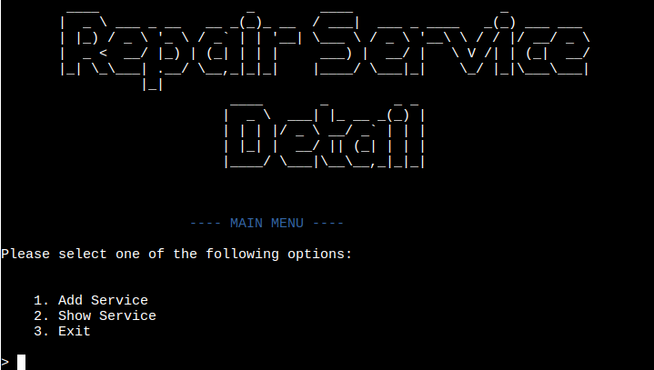
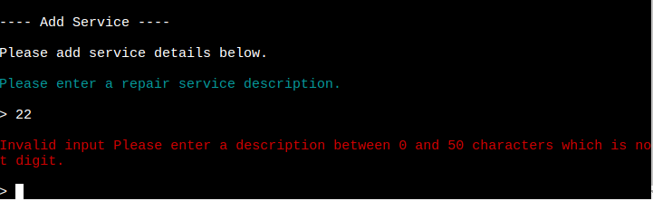
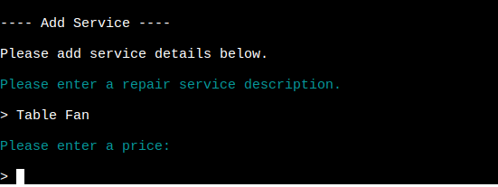
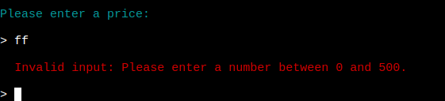
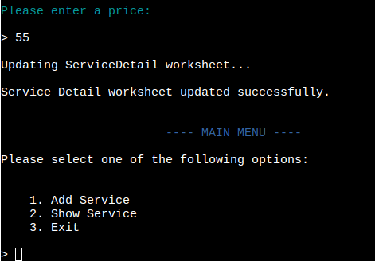
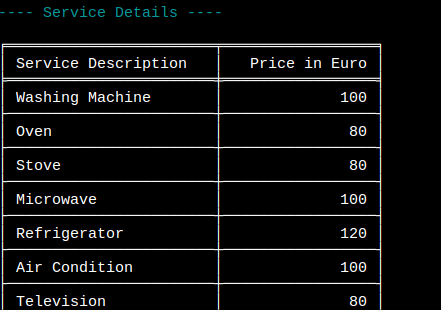

# Repair Service Detail

 Repair Service Detail is a Python command line interface  application used to enter Service Detail of a Repair Service Business. The user can enter service description and related price and view the total service and price list available.

The program automatically syncs all inputs to Google Sheets to ensure storage of and access to the service detail.

The live link can be found here [Repair Service Detail](https://servicedetail-e151ee9cb139.herokuapp.com/)

A view-only version of the Google Sheet can be viewed here.[Google Sheet](https://docs.google.com/spreadsheets/d/1HaDsMmEWqLoRjx94ya5nbn5xtAUYw9c7q6rqk3dACPQ/edit?gid=0#gid=0)

# Table of Contents

## Project Goal

* A Simple Program that makes easy input opportunity.
* All the inputs are properly validated.
* The user can view the service details in tabular format.
* An easy way to keep track of all the services.

# Logic Flow

In order to visualise the flow of steps required in the app, a Flow Diagram has been created using Lucid Charts. It gives a clear overview about the logic
of the application. 

# Features

## Title and Introduction

* At the home page the title of the application is shown.
* In the bottom of the title there are three options given for the user.
   * 1. Add Service
   * 2. Show Service
   * 3. Exit
* User can choose any option according to their wish.

## Add Service

If the user selects Add Service by pressing '1' in keyboard and hitting enter he/she will be asked to enter a service detail.
The service should be a description between 0 to 50 Character and not a digit. Service Can not be left empty.

When the user enters a proper service description command line will take the input and request the user to enter a price.

The price should be a positive integer between 0 to 500.

When the user enters a proper service price then the Service Details worksheet will be updated and success message would be 
shown in the terminal. And the user will be redirected to main menue again where he/she will get three options to choose.

## Show Service

If the user selects Show Service from main menu by pressing '2' in keyboard and hitting enter the all the service description and price
from google sheet would be shown as tabular format in the command window.

Which is followed by the main menu.

## Exit

If the user wants to exit from application he/she can select '3' and press enter.

# Technologies Used

* [Python3](https://en.wikipedia.org/wiki/Python_(programming_language))
* Code Institute's [Python Esssebtials Template](https://github.com/Code-Institute-Org/python-essentials-template)
* [GitHub](https://github.com/) used for version control.
* [HEROKU](https://dashboard.heroku.com/apps) used to deploy the live project.
* [Lucidchart](https://lucid.app/users/login#/login) - used to create the game flowchar
* [PEP8 Python Validator](https://pep8ci.herokuapp.com/) - used to validate all the Python code

## Python Libraries:

* [os](https://docs.python.org/3/library/os.html) was used to clear the screen when switching between menus or views.
* [pyfiglet](https://pypi.org/project/pyfiglet/0.7/) - for taking ASCII text and rendering it into ASCII art fonts.
* [colorama](https://pypi.org/project/colorama/) - for adding colour to terminal text.
* [gspread](https://pypi.org/project/gspread/) to allow communication with Google Sheets.
* [google.oauth2.service_account](https://google-auth.readthedocs.io/en/stable/index.html) used to validate credentials and grant access to google service accounts.
* [Sys](https://docs.python.org/3/library/sys.html) was used to create the typing effect on certain text outputs.
* [Tabulate](https://pypi.org/project/tabulate/) was used to display the expense data in tables.

# Bugs

There is no known bug in the application.

# Testing

## PEP8 Testing

The python file run.py has been passed through [PEP8](https://pep8ci.herokuapp.com/) . No error is reported.

## Input Testing

All inputs were tested throughly so make sure that proper input is provided.

* Service Description: Service description is tested to ensure that it's not a digit or empty space. It must be between 0 to 50 characters.
* Service Price: Service price is tested to ensure that it's not empty or negative number. It must be a positive integer between 0 and 500.

# Deployment 

The site is deployed by [Heroku](https://id.heroku.com/login) and live link can be found [here](https://servicedetail-e151ee9cb139.herokuapp.com/)

The following steps were taken:
1. Create an account and Log in to [Heroku](https://id.heroku.com/login) 
2. On the main page click the button labelled New in the top right corner and from the drop-down menu select "Create New App".
3. Enter a meaningful app name which is taken by Heroku. Heroku will show if the name is available or not.
4. Next select your region.
5. Click on the Create App button.
6. Click on the Settings Tab and scroll down to Config Vars.
7. Click Reveal Config Vars and Input CREDS and the content of your Google Sheet API creds file as another config var and click add.
8. Enter port into the Key box and 8000 into the Value box and click the Add button.
9. Next, scroll down to the Buildpack section click Add Buildpack select Python and click Save Changes.
10. Repeat step 11 to add node.js. Note: The Buildpacks must be in the correct order. If not click and drag them to move into the correct order.
11. Scroll to the top of the page and choose the Deploy tab.
12. Select Github as the deployment method.
13. Confirm you want to connect to GitHub.
14. Search for the repository name and click the connect button.
15. Scroll to the bottom of the deploy page and either click Enable Automatic Deploys for automatic deploys or Deploy Branch to deploy manually. Manually deployed branches will need re-deploying each time the repo is updated. I used Deploy Branch to deploy manually. 
16. Click View to view the deployed site.
17. The site is now live and operational.

# Credits

## Resources Used
* [Stack Overflow](https://stackoverflow.com/)
* [W3Schools](https://www.w3schools.com/)
* Code Institute's [Love Sandwich Project](https://github.com/farhatamannaislam/love-sandwitches)

# Acknowledgments

* My mentor Antonio Rodriguez for his valueable support and advice.
* Code Institute Slack community and tutors for their helpful responses and feedback.