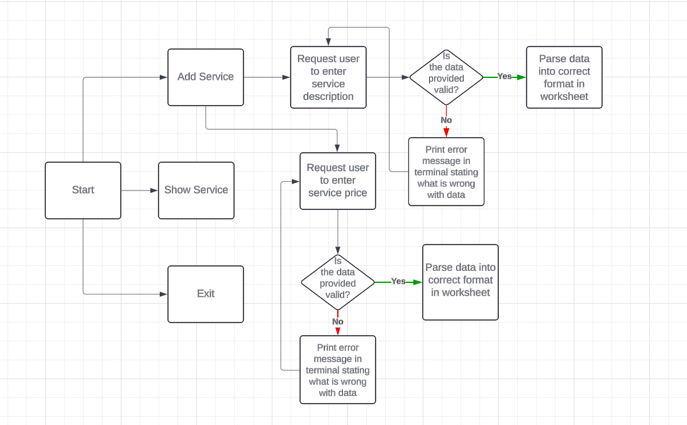

# Repair Service Detail

 Repair Service Detail is a Python command line interface  application used to enter Service Detail of a Repair Service Business. The user can enter service description and related price and view the total service and price list available.

The program automatically syncs all inputs to Google Sheets to ensure storage of and access to the service detail.

The live link can be found here [Repair Service Detail](https://servicedetail-e151ee9cb139.herokuapp.com/)

A view-only version of the Google Sheet can be viewed here.[Google Sheet](https://docs.google.com/spreadsheets/d/1HaDsMmEWqLoRjx94ya5nbn5xtAUYw9c7q6rqk3dACPQ/edit?gid=0#gid=0)

# Table of Contents

## Project Goal

* A Simple Program that makes easy input opportunity.
* All the inputs are properly validated.
* The user can view the service details in tabular format.
* An easy way to keep track of all the services.

# Logic Flow

In order to visualise the flow of steps required in the app, a Flow Diagram has been created using Lucid Charts. It gives a clear overview about the logic
of the application. 

# Features

## Title and Introduction

* At the home page the title of the application is shown.
* In the bottom of the title there are three options given for the user.
   * 1. Add Service
   * 2. Show Service
   * 3. Exit
* User can choose any option according to their wish.

## Add Service

If the user selects Add Service by pressing '1' in keyboard he/she will be asked to enter a service detail.
The service should be a description between 0 to 50 Character and not a digit. Service Can not be left empty.

When the user enters a proper service description command line will take the input and request the user to enter a price.

The price should be a positive integer between 0 to 500.

When the user enters a proper service price then the Service Details worksheet will be updated and success message would be 
shown in the terminal. And the user will be redirected to main menue again where he/she will get three options to choose.

